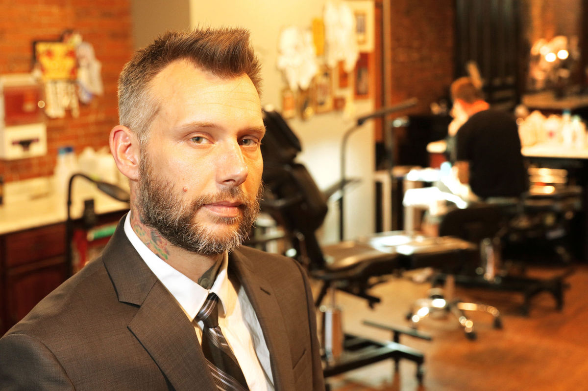

Some clips of my work:

### The Daily Iowan 

#### Muslimin: Burqini ban undermines personal freedom

(Credits: The Daily Iowan)

This is an opinion piece I wrote after the French Government announced the burqini ban, which has since been overturned. The hijab has long been a hot-button issue in the Western world, with views varying from either end of the spectrum. I identify as a Muslim, and I wear the hijab, so the issue definitely resonated with me enough to write a commentary that was so close to my heart. For more info check it out at the [Daily Iowan](http://daily-iowan.com/2016/08/25/shakirah-mohd-burqini-ban-undermines-personal-freedoms/)

#### Wage gap persist at the University of Iowa

(Credits: The Daily Iowan)

The wage gap between male and female faculty members at American Colleges across the country has always been a hotly contested issue. After going over data from the American Association of University Professors, I noticed a salary gap between male and female faculty members at the University of Iowa, hence the story. The conclusion that I made from my mini investigation was that a gap indeed existed, however, some school administrators insisted that these numbers should not be taken at face value. For more info check it out at the [Daily Iowan](http://daily-iowan.com/2016/04/14/wage-gap-persists-at-ui/) 

#### Tattoos in the workplace raise eyebrows

 

(Credits: The Quad City Times)

While on my summer internship at the Quad City Times in Davenport, Iowa, I wrote a story about tattoos in the workplace. I had to conduct a mini investgation to find out if tattoos were in fact a "thing" at the workplaces around the Quad Cities. Career advisors suggested that although tattoos had been more common in the workplace, it was still not quite the norm yet. For more info check it out at the [Quad City Times](http://qctimes.com/news/local/tattoos-in-the-workplace-raise-eyebrows/article_474aa3c3-3f2f-5cbc-b9fd-5882b78f9f64.html)

#### It's a ducky life for Wapello man

 

(Credits: The Muscatine Journal)

Brandon Brown, 35, of Wapello, Iowa, is a high school teacher who hand makes duck calls. Despite his tight work schedule that involves teaching and coaching, he still finds time to make duck calls just because of how passionate he is about it. This was a fun feature I wrote for the Muscatine Journal, who are associated with the Quad City Times. This story was picked up by the AP wire in Iowa, and the [Des Moines Register](http://www.desmoinesregister.com/story/news/2016/08/20/wapello-teacher-makes-duck-calls-hand/88960562/) and even the [Miami Herald](http://www.miamiherald.com/news/business/article96356132.html) shared my story. 

#### First Generation students: A feature story

<h3>First Generation Students:</h3>
   <iframe width="560" height="315" src="https://www.youtube.com/embed/Xg983YYTduU" frameborder="0" allowfullscreen></iframe>

For class, I wrote a feature story surrounding several first generation students from multiple backgrounds at the University of Iowa. One example of the students that I talked to, was Stacey Murray. Her story was especially impactful to me because she started out as a small town girl to being the Editor-in-Chief of the Daily Iowan — one the nation's biggest college newspapers. Murray is originally from Hopkinton, Iowa, which according to the Census Bureau, consisted of only 628 people in 2015. She was also the recipient of the prestigious Bill Mertens Memorial Daily Iowan Scholarship. For more info check it out at [guidetocollegeprobz](https://guidetocollegeprobz.wordpress.com)

<h3>Stacey Murray: A feature story:</h3>
   <iframe width="560" height="315" src="https://www.youtube.com/embed/zZTHzaKdKYE" frameborder="0" allowfullscreen></iframe>

